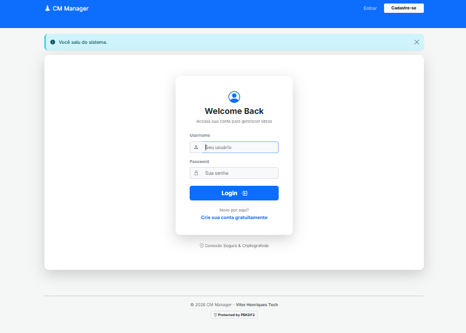
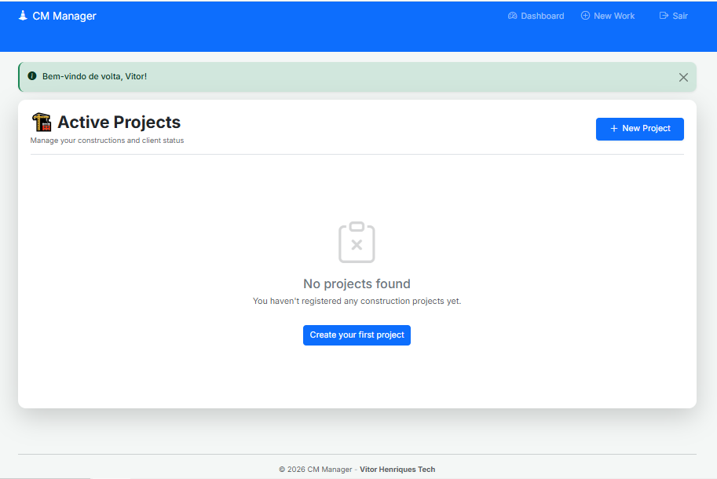

# 🏗️ CM Manager Pro - Construction Management MicroSaaS

[🇺🇸 English Version below]

## 🇧🇷 Sobre o Projeto
O **CM Manager Pro** é uma plataforma de gestão de obras projetada para trazer eficiência e controle para pequenas e médias construtoras. O sistema centraliza o gerenciamento de projetos, permitindo o acompanhamento em tempo real de status, custos e cronogramas através de uma interface intuitiva e segura.

### 🛠️ Diferenciais Técnicos:
- **Arquitetura Segura:** Autenticação de usuários via `Flask-Login` com proteção de rotas e gestão de sessões.
- **Criptografia Avançada:** Armazenamento de credenciais utilizando hashes `PBKDF2-SHA256` para máxima segurança dos dados.
- **Interface Pro:** UX focada em produtividade, desenvolvida com Bootstrap 5 e CSS personalizado (Design Clean/SaaS).
- **Persistência de Dados:** Banco de dados relacional otimizado para operações CRUD rápidas e integridade referencial.

---

## 🇺🇸 About the Project
**CM Manager Pro** is a construction management MicroSaaS built to streamline workflows for small to medium-sized construction firms. It centralizes project management, enabling real-time tracking of status, costs, and timelines through a secure, high-performance web interface.

### 🛠️ Technical Highlights:
- **Production-Ready Auth:** Secure user authentication and session management via `Flask-Login`.
- **Data Security:** Industry-standard password hashing using `PBKDF2-SHA256`.
- **Modern UI/UX:** Clean SaaS-style interface built with Bootstrap 5 for professional aesthetics and responsiveness.
- **Relational Database:** Optimized CRUD operations ensuring data integrity and fast retrieval.

---

## 🚀 Tech Stack
- **Backend:** Python 3.x / Flask
- **Security:** Werkzeug Security / Flask-Login
- **Frontend:** HTML5, CSS3 (Modern UI), Bootstrap 5, Jinja2
- **Database:** SQLite (Relational)
- **Deployment:** Gunicorn (Ready for Render/Heroku)

---

## 📸 Screenshots

### Login Page


### Main Dashboard


## Instalação e Execução / Setup

1. **Clone & Folder:**
   ```bash
   git clone https://github.com/Vitorenriks/cm-manager-pro.git
   cd cm-manager-pro
   ```

2. **Requirements:**
   ```bash
   pip install -r requirements.txt
   ```

3. **Launch:**
   ```bash
   python setup_db.py
   flask run
   ```

---

## 👤 Author

**Vitor Henriques** - *Aspiring Software Engineer*

> "Building software that builds the world."

linkedin : https://linkedin.com/in/vitor-henriques-86a37b2a4
